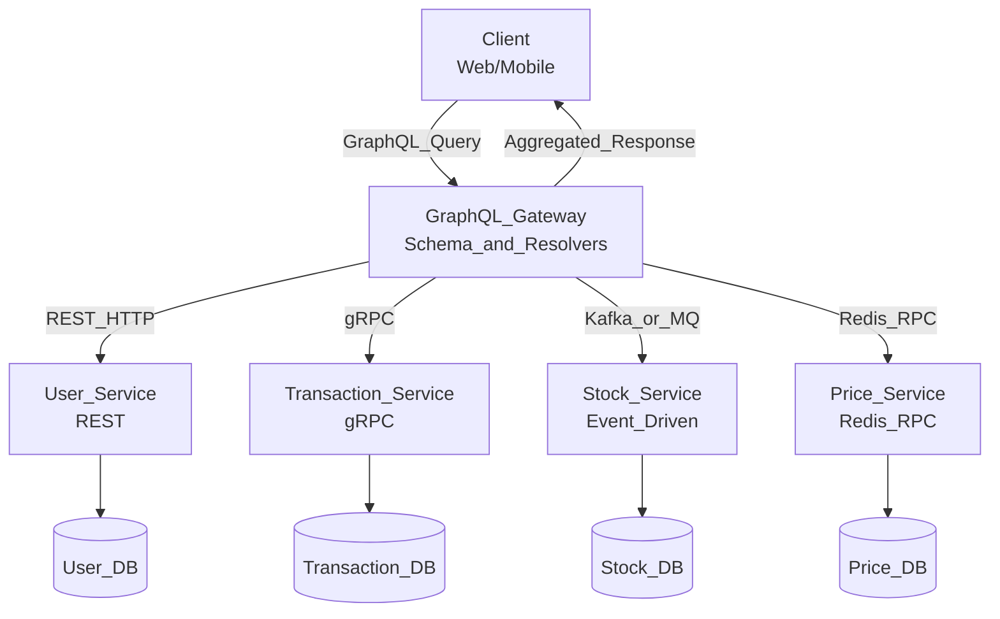

# Identitas Mahasiswa
Nama : Rijalu Nur Fadzila

NIM : 245410054

# 1. CAP dan BASE dalam Sistem Terdistribusi

## CAP (Consistency, Availability, Partition Tolerance)

Teorema CAP menyatakan bahwa sebuah sistem terdistribusi tidak bisa
memiliki ketiganya sekaligus secara penuh.

Karena **P wajib** untuk sistem terdistribusi, maka sistem harus memilih
**C atau A**.

-   **CP** → mengutamakan konsistensi, mengorbankan ketersediaan.
-   **AP** → mengutamakan ketersediaan, mengorbankan konsistensi sesaat.
## BASE (Basically Available, Soft State, Eventual Consistency)

BASE adalah prinsip desain untuk sistem yang memilih **AP** pada CAP.

-   **Basically Available** → Sistem tetap responsif meski ada gangguan.
-   **Soft State** → State dapat berubah seiring waktu meski tanpa input baru.
-   **Eventual Consistency** → Node pada akhirnya menjadi konsisten, namun tidak harus segera.
## Keterkaitan CAP dan BASE

- BASE adalah cara mewujudkan sistem **AP** dalam teorema CAP.

## Contoh Gabungan CAP dan BASE

### Sistem Kasir Minimarket

**Situasi:** 
- Banyak cabang
- Jaringan kadang putus
- Tetap harus bisa transaksi

### CAP Analysis

-   Jaringan antar cabang bisa putus → P wajib
-   Tetap harus transaksi → pilih Availability
-   Konsistensi instan tidak mungkin → Consistency dikorbankan sementara

**Dapat disimpulkan sistem bertipe AP.**

### BASE Implementation

-   **Basically Available:** kasir tetap bisa scan barang & transaksi.
-   **Soft State:** harga promo atau semacamnya bisa berbeda beberapa saat antar cabang.
-   **Eventual Consistency:** sistem sinkron ulang pada malam hari.

## 2. GraphQL dan IPC dalam Sistem Terdistribusi

GraphQL **bukan protokol komunikasi antar proses**, melainkan bahasa
query dan spesifikasi API yang menentukan:
- apa yang dapat diminta klien
- bagaimana data disusun
- bentuk respons

GraphQL tetap membutuhkan media IPC untuk request-response.

### Keterkaitan:

-   GraphQL mengatur *permintaan data*
-   IPC mengatur *cara proses backend saling berkomunikasi*

## Diagram

